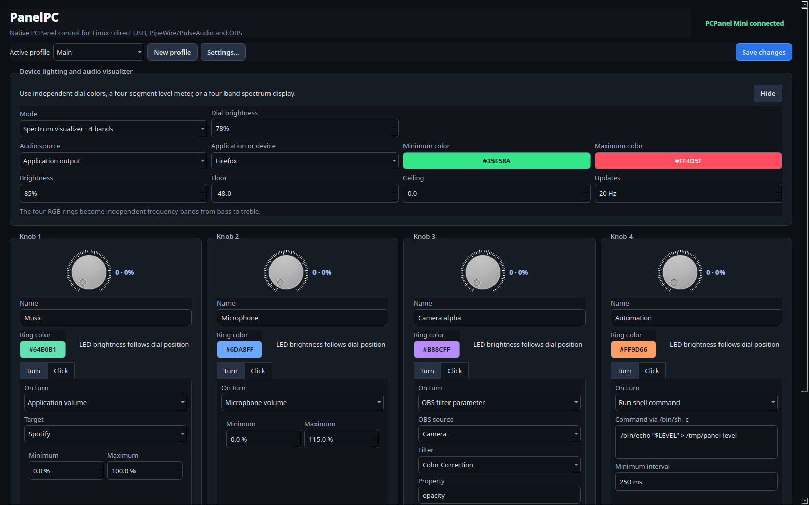
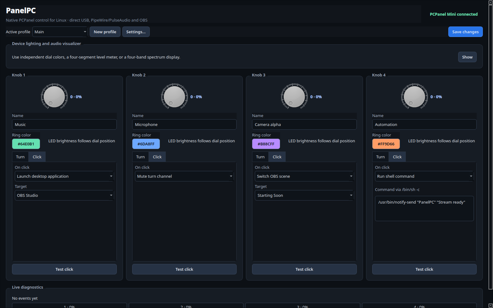
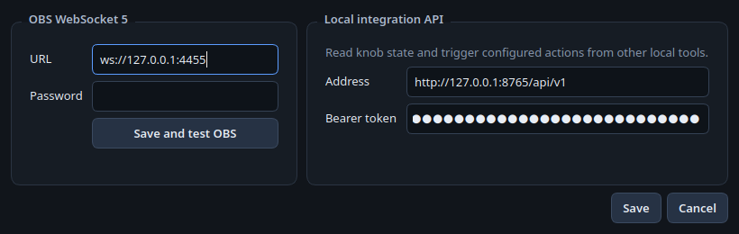

# PanelPC

PanelPC is a native Linux controller for the PCPanel Lite/Mini with four clickable RGB knobs. It controls PipeWire/PulseAudio audio, device lighting, and OBS Studio through WebSocket 5. The current development branch adds a native Qt 6 desktop interface while retaining the loopback HTTP service as an authenticated integration API.



The click page exposes application launching, profile and OBS actions, commands, and physical-button testing:



Global OBS WebSocket credentials and the authenticated local API stay in a compact Settings dialog:



## Motivation

PanelPC exists because the two available solutions we tested—the official application and a community alternative—did not work adequately on Linux. The observed problems included an impractical interface, poor PipeWire/PulseAudio channel selection, limited OBS integration, and, during one test, a system that became unresponsive when a knob was moved.

This project was built specifically for Linux and communicates directly with `hidraw`, PipeWire/PulseAudio, and OBS WebSocket. It does not capture keyboard or mouse input and does not depend on an application primarily designed for another operating system.

## Features

- Direct support for the four-knob PCPanel Lite/Mini, including clicks and RGB lighting.
- Volume and mute control for the default output or input.
- Selection of specific PipeWire/PulseAudio devices and application streams.
- OBS WebSocket 5 integration: volume, mute, scenes, recording, streaming, and numeric filter settings.
- Per-knob RGB colors, global brightness, and dial-position brightness tracking.
- **VU Toy** and **four-band spectrum analyzer** modes that turn the physical PCPanel into a real-time desktop audio visualizer.
- Shell actions for turns and clicks, with level variables, timeout, and configurable rate limiting.
- Click actions can launch installed Freedesktop applications selected by name. PanelPC uses KDE's `kstart`, GNOME's `gtk-launch`, or `gio launch` according to the active desktop session, with a direct no-shell `Exec` fallback when no desktop launcher is available.
- Complete profiles and profile switching from a physical knob click.
- Native Qt 6 interface with the four physical controls presented side by side.
- System tray controls for opening the panel, global OBS/API settings, application information, and quitting; closing the main window keeps PanelPC available in the tray.
- The controller, interface, USB handling, and integration API run in one process; the desktop interface is not an HTTP client.
- The embedded web interface remains available as a compatibility fallback during the native-interface transition.
- Bounded queues and event coalescing to avoid blocking the desktop or flooding USB.

Exposing the panel as an OpenRGB device is considered a future enhancement and is not part of the current implementation.

## AI-assisted development

This project does not hide its use of artificial intelligence. The initial design, code, and documentation were developed with assistance from **OpenAI Codex**, under human direction. Functional decisions were specified and reviewed by the hardware owner, and the integrations were tested during development with a real PCPanel Mini, a PipeWire/PulseAudio session, and OBS Studio.

AI assistance is not a substitute for code review. Automated tests, Go's race detector, and static analysis are run before builds. Review the code and any configured commands before using it on another system.

## Why it should not freeze the desktop

- It reads only the PCPanel `hidraw` node; it never captures keyboard or mouse input.
- The HID queue has a fixed capacity of 32 events and never blocks the device reader.
- Knob turns provide absolute values, so only the latest value for each knob is retained every 50 ms.
- Only one external operation runs at a time, with at most one additional operation waiting.
- Every `wpctl` or `pactl` call times out after 1.5 seconds.
- Firmware announcements received during the first 400 ms are ignored as actions, preventing unexpected audio changes when the panel is connected.
- Initial knob positions are still displayed in the interface for diagnostics.
- RGB output uses a single-slot queue where a newer update replaces the pending one.
- The audio meter uses continuous capture and limits RGB writes to 5–30 updates per second.
- Turn commands have a configurable minimum interval and retain only the newest level.

## Building

The headless/web build requires Go 1.23 or newer:

```bash
make test
make build
./build/panelpc
```

The interface opens at `http://127.0.0.1:8765`. To run without opening a browser:

```bash
./build/panelpc -no-browser
```

### Native Qt interface

Building the desktop executable requires a C++ compiler, `pkg-config`, and the Qt 6 development files in addition to Go. These are build-time requirements only; running the resulting binary requires the compatible Qt 6 shared libraries, not the SDK or headers.

```bash
make build-qt
./build/panelpc-qt
```

The Qt executable talks directly to the same in-process controller used by the hardware engine. It also starts the authenticated integration API on `127.0.0.1:8765`; it does not connect back to itself over HTTP. Global OBS WebSocket and integration API details live in **Settings**, available from both the system tray and the main toolbar. Closing the main window hides it to the tray; use **Quit** in the tray menu to stop PanelPC.

Do not run it alongside the installed `panelpc.service`, because both processes would compete for the PCPanel and the same API port. For an interface-only preview that leaves the service untouched:

```bash
./build/panelpc-qt --no-hardware --no-api
```

The AppImage build bundles the required Qt runtime libraries, so users do not need to install Qt or a development SDK. It defaults to the X11 backend when `DISPLAY` is available, including XWayland on Wayland desktops, to avoid missing bundled Wayland shell/buffer integrations. An explicit `QT_QPA_PLATFORM` setting is preserved. A Wayland-only session without XWayland is not currently verified. The standalone raw executable intentionally remains dynamically linked to the distribution's Qt 6 runtime.

Documentation screenshots are rendered from the real Qt widgets in a deterministic preview configuration:

```bash
make screenshots
```

## Installing a release

### AppImage desktop application — recommended

Download the x86_64 AppImage from GitHub Releases and verify its adjacent checksum file:

```bash
sha256sum -c PanelPC-x86_64.AppImage.sha256
chmod +x PanelPC-x86_64.AppImage
./PanelPC-x86_64.AppImage
```

It can remain portable, or install itself entirely inside the current user's home directory:

```bash
./PanelPC-x86_64.AppImage --install-user
```

Install it and start it automatically with the desktop session:

```bash
./PanelPC-x86_64.AppImage --install-user --autostart
```

Autostart can later be changed independently, and uninstalling preserves `~/.config/panelpc/config.json`:

```bash
./PanelPC-x86_64.AppImage --disable-autostart
./PanelPC-x86_64.AppImage --enable-autostart
./PanelPC-x86_64.AppImage --uninstall-user
```

Run every installation command as the regular desktop user, without `sudo`. The installed AppImage appears in the application menu and uses the system tray. If the old headless service is installed, stop and disable it before starting the Qt application so the two processes do not compete for the USB device or API port:

```bash
systemctl --user disable --now panelpc.service
```

### Headless/web ZIP

The ZIP contains the static headless controller and web interface. Download it for your architecture, verify the release checksum, extract it, and inspect the installer before running it:

```bash
sha256sum -c SHA256SUMS
unzip panelpc-linux-amd64.zip
cd panelpc-linux-amd64
less install.sh
./install.sh --user
```

The rootless `--user` installation places the headless binary in `~/.local/bin`, installs a systemd user unit, and starts PanelPC in the current desktop session.

### Bazzite and other immutable/stateless distributions

The AppImage user installation is recommended:

```bash
./PanelPC-x86_64.AppImage --install-user --autostart
```

This mode is designed for Bazzite, Fedora Atomic desktops such as Silverblue and Kinoite, SteamOS, and similar systems. It writes only to the user's home directory, survives operating-system image updates, and does not use `rpm-ostree`, layering, or writable overlays. The headless ZIP's `./install.sh --user` remains available if a web-only service is preferred.

### Traditional distributions

The AppImage `--install-user` mode is also recommended on Fedora, Ubuntu, Debian, Arch Linux, and other conventional distributions. The headless ZIP additionally offers an optional system-wide binary installation:

```bash
./install.sh --system
```

Do not run the installer itself with `sudo`. In `--system` mode it requests `sudo` only while copying the binary to `/usr/local/bin`; PanelPC still runs as a systemd user service so it can access the user's PipeWire session and OBS instance.

### No drivers or device-permission changes

PanelPC does **not** install a kernel module, USB driver, HID driver, or background input driver. There is no `udev` rule in this repository, and the installer does not create, edit, reload, or remove one. No `MODE="0666"`, custom group membership, or broad HID permission change is applied.

You do not need to install drivers or change `udev` configuration. PanelPC uses the device access already provided to the active desktop session. If a distribution reports a permission error, do not run PanelPC as root and do not grant global access to every `hidraw` device; open an issue with the distribution, desktop session, and device information instead.

## Audio

PanelPC uses standard tools already included with PipeWire-based Linux systems:

- `wpctl` for the default output and microphone.
- `pactl` for application streams. The selector does not depend on ephemeral PulseAudio indexes; it resolves the application name whenever the stream list is refreshed.
- `pactl` for specific outputs and inputs. The interface displays the friendly description while storing the stable `alsa_output...` or `alsa_input...` name.

Selectors are populated from the active PipeWire/PulseAudio session. Output monitor sources are excluded from the microphone list so they are not confused with real capture devices.

## Shell commands

A turn or click can execute a command through `/bin/sh -c`. The process receives:

- `LEVEL`, rounded from 0 to 100.
- `RAW_LEVEL`, the original value from 0 to 255.

Example:

```sh
/bin/echo "$LEVEL" > /tmp/panelpc-level
```

Turn actions support a minimum interval from 50 to 60000 ms. Every execution times out after five seconds, and PanelPC terminates the complete process group if the timeout is exceeded.

## OBS

In OBS, open **Tools → WebSocket Server Settings**, enable the server, and enter the same URL and password in PanelPC. The default port is `4455`.

Supported actions include:

- Controlling and muting an OBS input.
- Changing the current program scene.
- Toggling recording.
- Toggling streaming.
- Controlling a numeric filter setting through `SetSourceFilterSettings`.

### Alpha/opacity example

1. Add a **Color Correction** filter to the OBS source.
2. Select **OBS filter parameter** for the knob turn action.
3. Select the source and filter, then use `opacity` as the setting.
4. Use a range from `0` to `1` with current OBS versions. The legacy Color Correction filter uses `0` to `100`.

Sources and filters are queried directly from OBS and appear as suggestions in the interface.

## Integration API

PanelPC exposes a versioned HTTP API for local integrations at `http://127.0.0.1:8765/api/v1`. It listens only on loopback by default and requires the persistent bearer token stored in `~/.config/panelpc/config.json` with `0600` permissions.

Read the current device, visualizer, profile, and knob state:

```bash
PANELPC_TOKEN=$(jq -r '.api.token' ~/.config/panelpc/config.json)
curl --fail --silent \
  -H "Authorization: Bearer $PANELPC_TOKEN" \
  http://127.0.0.1:8765/api/v1/state
```

Launch the action already assigned to knob 2's click:

```bash
curl --fail --silent \
  -H "Authorization: Bearer $PANELPC_TOKEN" \
  -H 'Content-Type: application/json' \
  --data '{"knob":2,"kind":"click"}' \
  http://127.0.0.1:8765/api/v1/actions
```

Launch knob 1's configured turn action at its midpoint:

```bash
curl --fail --silent \
  -H "Authorization: Bearer $PANELPC_TOKEN" \
  -H 'Content-Type: application/json' \
  --data '{"knob":1,"kind":"turn","value":128}' \
  http://127.0.0.1:8765/api/v1/actions
```

Knob numbers in this public API are `1` through `4`; turn values are `0` through `255`. The endpoint can only trigger actions already present in the active profile. It does not accept a shell command, OBS request, or audio target in the HTTP payload. Turn coalescing, command rate limits, and the bounded action queue apply equally to physical and API-generated events.

## RGB lighting

Each knob has its own color and supports two basic modes:

- **Static:** keeps the selected color and brightness.
- **Track dial:** uses the firmware's black-to-color volume gradient so the LED follows the knob position without generating a USB write for every turn.

Global brightness limits all four colors before they are sent to the device.

## Using the PCPanel as an audio visualizer

PanelPC can repurpose all four physical RGB rings as a real-time audio visualizer. This is independent from the knob assignments: turns and clicks continue to control audio, OBS, commands, or profiles while the lighting reacts to a selected audio stream.

The visualizer can listen to:

- The default output or input.
- A specific PipeWire/PulseAudio device.
- The output stream of a specific application.

The minimum and maximum colors, brightness, dB floor and ceiling, and an update rate from 5 to 30 frames per second are configurable. Audio is captured continuously from a single PipeWire/PulseAudio stream, while RGB writes remain bounded and coalesced. These modes require `parec`, normally provided by the PulseAudio compatibility tools used with PipeWire.

### VU Toy: four-segment level visualizer

**VU Toy** transforms the complete PCPanel into a four-segment volume meter. The rings illuminate progressively from left to right as the selected signal gets louder: the first knob represents the beginning of the configured dB range and the fourth represents its highest level. Colors are interpolated between the selected minimum and maximum colors, giving the hardware the appearance of a compact physical VU display.

This mode is useful for watching overall microphone activity, application output, a capture interface, or the system mix without keeping an on-screen meter visible.

### Four-band spectrum analyzer

The **four-band spectrum analyzer** turns the four knobs into independent frequency indicators. PanelPC performs a real-time FFT on the selected stream, and each ring responds only to its assigned part of the spectrum:

- Bass: 60–250 Hz.
- Low mids: 250 Hz–1 kHz.
- High mids: 1–4 kHz.
- Treble: 4–20 kHz.

Each ring changes intensity independently, so bass hits, voices, instruments, and high-frequency detail produce visibly different patterns across the physical panel. Together, the four knobs act as a small hardware spectrum display rather than a single volume bar.

## Profiles

Each profile stores all four assignments and the complete lighting configuration, including level-meter and spectrum modes. OBS settings and its password are global. The top selector changes the active profile, while **New profile** copies the currently visible configuration. A knob click can also use the **Switch profile** action, and the change is persisted immediately.

## Safety recommendations

- **Do not run PanelPC, its AppImage management options, or `install.sh` as root.** Audio, OBS, and desktop-session permissions belong to the logged-in user.
- Do not run PanelPC at the same time as another PCPanel controller. Two processes competing for the same HID device can produce unreliable behavior.
- Keep the web interface on its default loopback address. Do not expose it to a LAN or the internet.
- Shell actions intentionally execute `/bin/sh -c`. Review every configured command and never paste untrusted commands into the interface.
- Application actions only expose valid Freedesktop entries, but desktop shortcuts are still executable content. Select them only from applications and locations you trust.
- Inspect `install.sh` and verify `SHA256SUMS` before installing a downloaded release.
- Do not apply unrelated driver, group, or `udev` instructions from another PCPanel application to PanelPC.

The configuration, including the OBS password and persistent integration token, is stored with `0600` permissions in `~/.config/panelpc/config.json`. The legacy web interface uses a separate random per-process token embedded into its page. The integration API requires its bearer token on every request.

## Continuous integration and releases

The GitHub Actions workflow runs the full test suite with Go's race detector and runs `go vet`. After those checks pass, an x86_64 Debian 12 build container compiles the Qt executable and uses verified, pinned `linuxdeploy` and Qt-plugin downloads to bundle a broadly compatible Qt runtime. CI produces:

- `panelpc-linux-amd64.zip`
- `PanelPC-x86_64.AppImage`

Distribution targets x86_64 (amd64) only. The AppImage job smoke-tests Qt startup and the complete user-install/autostart/uninstall lifecycle. The ZIP contains the static binary, `install.sh`, the systemd user-service template, this README, LICENSE, and the interface screenshots. Pushes and pull requests retain every package as a CI artifact. Pushing a tag beginning with `v`, such as `v0.1.0`, creates a GitHub Release containing the headless ZIP, the x86_64 AppImage, its adjacent checksum, and the combined `SHA256SUMS`.

## License

Copyright © 2026 PanelPC contributors.

PanelPC is free software: you can redistribute it and/or modify it under the
terms of the GNU General Public License as published by the Free Software
Foundation, either version 3 of the License, or (at your option) any later
version (`GPL-3.0-or-later`).

PanelPC is distributed in the hope that it will be useful, but WITHOUT ANY
WARRANTY; without even the implied warranty of MERCHANTABILITY or FITNESS FOR
A PARTICULAR PURPOSE. See [LICENSE](LICENSE) for the complete license text.
Third-party components retain their respective licenses.
